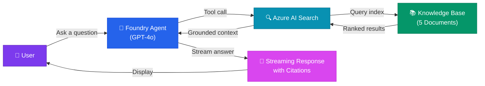
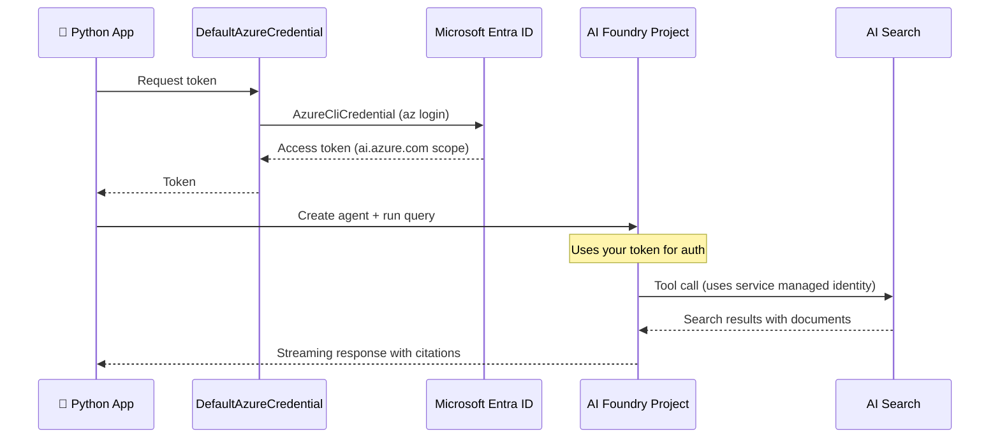
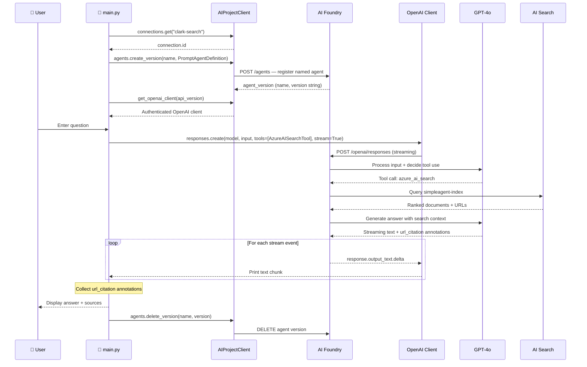

# 🎯 SimpleAgent — Show & Tell

> **An AI agent that searches a knowledge base and gives grounded answers with citations.**

---

## 🏗️ Architecture



The agent acts as an intelligent middleman: it receives your question, decides it needs information from the knowledge base, calls Azure AI Search to find relevant documents, and then synthesizes a grounded answer with URL citations.

---

## ✨ The Magic: Responses API vs Assistants API

| Feature | **Responses API** (what we use) | **Assistants API** (older) |
|---------|-------------------------------|--------------------------|
| State | Stateless — no persistent threads | Stateful — persistent threads |
| Pattern | `create_version()` → `get_openai_client()` → `responses.create()` | `create()` → `create_thread()` → `create_run()` |
| Streaming | Native streaming events | Polling or streaming |
| SDK Version | `azure-ai-projects >= 2.0.0` | `azure-ai-projects 1.x` |
| Best For | Simple request/response agents | Multi-turn conversations with memory |

```mermaid
flowchart TB
    subgraph Responses["Responses API (Stateless)"]
        direction LR
        R1["Create Agent<br/>Version"] --> R2["Get OpenAI Client"]
        R2 --> R3["responses.create()"]
        R3 --> R4["Stream Response"]
    end

    subgraph Assistants["Assistants API (Stateful)"]
        direction LR
        A1["Create<br/>Assistant"] --> A2["Create Thread"]
        A2 --> A3["Add Message"]
        A3 --> A4["Create Run"]
        A4 --> A5["Poll/Stream"]
    end

    style Responses fill:#1e3a5f,stroke:#3b82f6,color:#fff
    style Assistants fill:#3b1f2b,stroke:#f43f5e,color:#fff
    style R1 fill:#3b82f6,stroke:#2563eb,color:#fff
    style R2 fill:#3b82f6,stroke:#2563eb,color:#fff
    style R3 fill:#3b82f6,stroke:#2563eb,color:#fff
    style R4 fill:#3b82f6,stroke:#2563eb,color:#fff
    style A1 fill:#f43f5e,stroke:#e11d48,color:#fff
    style A2 fill:#f43f5e,stroke:#e11d48,color:#fff
    style A3 fill:#f43f5e,stroke:#e11d48,color:#fff
    style A4 fill:#f43f5e,stroke:#e11d48,color:#fff
    style A5 fill:#f43f5e,stroke:#e11d48,color:#fff
```



**Why Responses API?** Simpler, fewer API calls, no thread management. Perfect for agents that answer questions without needing conversation history.

---

## 🔐 Authentication Flow



**No API keys needed!** Everything uses Entra ID (Azure AD) authentication via role-based access control (RBAC).

---

## 📚 What's in the Knowledge Base

We uploaded 5 documents to Azure AI Search covering Azure AI Foundry topics:

| # | Title | Category | What it covers |
|---|-------|----------|---------------|
| 1 | Azure AI Foundry Overview | overview | Platform overview, hub-less architecture, Responses vs Assistants API |
| 2 | Azure AI Foundry Responses API | api | SDK details, create_version pattern, tool support, authentication |
| 3 | AI Search Integration with Foundry Agents | tools | AzureAISearchTool, connection setup, semantic/vector search |
| 4 | DefaultAzureCredential Authentication Chain | auth | Credential chain order, local dev vs production, managed identity |
| 5 | RBAC Roles for Azure AI Foundry with AI Search | security | Required roles (AI Developer, Search Index Data Reader, etc.) |

---

## 🎬 Demo Script

### Step 1: Validate the Environment

```bash
python validate_environment.py
```

**What to show:** All 9 checks should pass with green checkmarks ✅

- Package version (azure-ai-projects 2.0.0)
- Environment variables (4 required vars)
- DNS resolution
- HTTPS connectivity
- Authentication (DefaultAzureCredential)
- Project connection (clark-search found)

### Step 2: Run the Agent

```bash
python main.py
```

**What to show:** The agent initializes:
- Verifies the AI Search connection
- Creates a named, versioned agent (`simpleagent-search`) registered in Foundry
- Presents an interactive prompt

### Step 3: Ask Questions and Watch Streaming

Type a question and watch the response stream in real-time with citations.

### 🎤 Sample Questions to Ask

These questions are designed to hit our knowledge base and produce great answers:

1. **"What is Azure AI Foundry and what's new in 2025?"**
   → Hits doc #1, covers hub-less architecture

2. **"How does the Responses API differ from the Assistants API?"**
   → Hits docs #1 and #2, great for comparison

3. **"What RBAC roles do I need to run an AI agent with Azure AI Search?"**
   → Hits docs #3 and #5, shows specific role names

4. **"How does DefaultAzureCredential work? What order does it try?"**
   → Hits doc #4, walks through the credential chain

5. **"How do I connect Azure AI Search to a Foundry agent?"**
   → Hits doc #3, covers AzureAISearchTool setup

---

## 🔧 What's Happening Under the Hood



**Key insight:** The agent is registered by name (`simpleagent-search`) and cleaned up after each session. The Responses API invocation goes through the OpenAI-compatible client — not a custom `run()` method — keeping the code portable and familiar.

---

## 🏢 Azure Resources Used

| Resource | Type | Name | Purpose | Portal Link |
|----------|------|------|---------|-------------|
| Resource Group | Microsoft.Resources | `rg-simpleagent-demo` | Container for all resources | [Portal](https://portal.azure.com/#@/resource/subscriptions/50948ce7-018f-4a26-9cf3-2b4f982b5358/resourceGroups/rg-simpleagent-demo) |
| AI Services | Microsoft.CognitiveServices | `clark-simpleagent-ai` | Hosts Foundry project + GPT-4o | [Portal](https://portal.azure.com/#@/resource/subscriptions/50948ce7-018f-4a26-9cf3-2b4f982b5358/resourceGroups/rg-simpleagent-demo/providers/Microsoft.CognitiveServices/accounts/clark-simpleagent-ai) |
| Foundry Project | CognitiveServices/project | `simpleagent` | Agent orchestration + connections | [AI Foundry](https://ai.azure.com) |
| Model Deployment | CognitiveServices/deployment | `gpt-4o` (2024-11-20) | Language model for the agent | — |
| AI Search | Microsoft.Search | `clark-simpleagent-search` | Knowledge base search service | [Portal](https://portal.azure.com/#@/resource/subscriptions/50948ce7-018f-4a26-9cf3-2b4f982b5358/resourceGroups/rg-simpleagent-demo/providers/Microsoft.Search/searchServices/clark-simpleagent-search) |
| Search Index | — | `simpleagent-index` | 5 documents about Azure AI Foundry | — |
| Connection | CognitiveServices/connection | `clark-search` | Links AI Search to Foundry project | — |

**Estimated monthly cost:** ~$80/month (AI Search Basic ~$75 + AI Services S0 pay-per-use)

---

## 🧹 Cleanup

When done with the demo, delete everything:

```bash
az group delete --name rg-simpleagent-demo --yes --no-wait
```

---

## 🔒 Enterprise Scenario: Customer VNet Injection

> **This section applies when Foundry is deployed in a locked-down enterprise environment with private networking (BYO VNet / Standard Setup with private networking).**

In this scenario, the Foundry agent runtime is **injected into a customer-owned subnet** (delegated to `Microsoft.App/environments`), and all AI Search traffic flows through private endpoints within the VNet.

### Why Playground Works But Agent Doesn't in VNet Mode

| | Foundry Playground | Agent AI Search Tool |
|---|---|---|
| **Execution location** | Foundry platform network (Microsoft) | Your injected agent subnet |
| **DNS resolution** | Foundry platform's internal DNS | Your VNet's Private DNS configuration |
| **Private DNS zone needed?** | No — platform handles it | ✅ Yes — must be linked to agent VNet |
| **If DNS zone not linked** | Playground works fine ✅ | Agent returns empty / 503 ❌ |

**The key insight:** Same index, two different network paths, two different DNS resolvers.

### VNet Validation Script

```bash
# Validate private networking setup
python validate_vnet_environment.py --mode private

# Skip the end-to-end query (faster, DNS/connectivity only)
python validate_vnet_environment.py --mode private --skip-e2e
```

This script checks:
- DNS resolution (must resolve to private RFC1918 IP)
- TCP 443 reachability
- Private DNS zone linkage (via SDK)
- NSG/PE connectivity
- End-to-end agent query

### Minimum Requirements for VNet Mode

```
✅ Agent subnet /24 — delegated to Microsoft.App/environments
✅ AI Search private endpoint — in resource subnet
✅ Private DNS zone — privatelink.search.windows.net linked to agent VNet
✅ NSG rule — agent subnet → resource subnet TCP 443 outbound
✅ AI Search — public access disabled
✅ Foundry managed identity — Search Index Data Reader role
```

See full configuration guide:
`AllanVault/Employees/Azure-AI-Foundry/foundry-customer-vnet-injection-guide.md`
