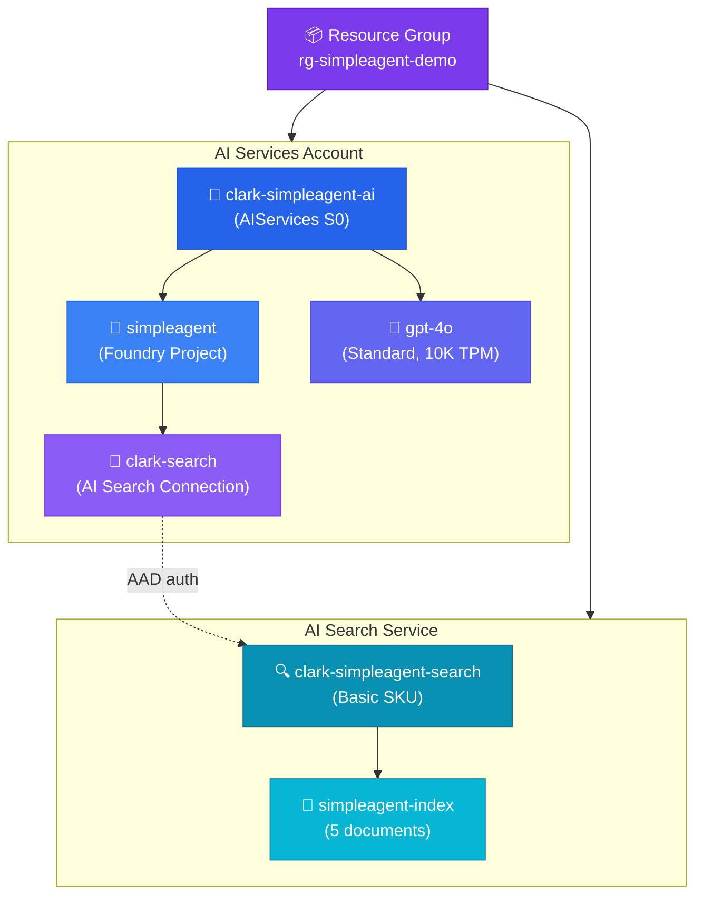

# 🔧 Provisioning Guide — SimpleAgent Demo

Step-by-step instructions to provision all Azure resources needed to run the SimpleAgent demo from scratch.

---

## Prerequisites

- **Azure CLI** (`az`) installed and authenticated (`az login`)
- **Subscription** with access to create AI Services, AI Search, and role assignments
- **Python 3.10+** with pip
- **Git** for cloning and pushing

```bash
# Verify prerequisites
az account show --query '{name:name, id:id, user:user.name}' -o json
python3 --version
git --version
```

---

## Resource Overview



---

## Step 1: Create Resource Group

```bash
az group create \
  --name rg-simpleagent-demo \
  --location eastus \
  --tags owner=clark purpose=demo project=simpleagent temporary=false
```

## Step 2: Create AI Services Account

```bash
az cognitiveservices account create \
  --name clark-simpleagent-ai \
  --resource-group rg-simpleagent-demo \
  --kind AIServices \
  --sku S0 \
  --location eastus \
  --yes \
  --tags owner=clark purpose=demo project=simpleagent temporary=false
```

## Step 3: Set Custom Subdomain

Required for Foundry project creation. If you didn't set `--custom-domain` during creation:

```bash
az cognitiveservices account update \
  --name clark-simpleagent-ai \
  --resource-group rg-simpleagent-demo \
  --custom-domain clark-simpleagent-ai
```

This enables the endpoint `https://clark-simpleagent-ai.services.ai.azure.com/` and also enables the system-assigned managed identity.

## Step 4: Create Foundry Project

Uses the ARM REST API since no direct CLI command exists yet:

```bash
SUBSCRIPTION="50948ce7-018f-4a26-9cf3-2b4f982b5358"
TOKEN=$(az account get-access-token --resource https://management.azure.com/ --query accessToken -o tsv)

curl -X PUT \
  "https://management.azure.com/subscriptions/${SUBSCRIPTION}/resourceGroups/rg-simpleagent-demo/providers/Microsoft.CognitiveServices/accounts/clark-simpleagent-ai/projects/simpleagent?api-version=2025-04-01-preview" \
  -H "Authorization: Bearer ${TOKEN}" \
  -H "Content-Type: application/json" \
  -d '{"location":"eastus","identity":{"type":"SystemAssigned"},"properties":{}}'
```

> **Note:** The `identity` field with `SystemAssigned` is required — the API will reject the request without it.

**Project endpoint:** `https://clark-simpleagent-ai.services.ai.azure.com/api/projects/simpleagent`

## Step 5: Deploy GPT-4o Model

```bash
az cognitiveservices account deployment create \
  --name clark-simpleagent-ai \
  --resource-group rg-simpleagent-demo \
  --deployment-name gpt-4o \
  --model-name gpt-4o \
  --model-version "2024-11-20" \
  --model-format OpenAI \
  --sku-capacity 10 \
  --sku-name Standard
```

## Step 6: Create AI Search Service

```bash
az search service create \
  --name clark-simpleagent-search \
  --resource-group rg-simpleagent-demo \
  --sku basic \
  --location eastus \
  --tags owner=clark purpose=demo project=simpleagent temporary=false
```

## Step 7: Assign RBAC Roles

```bash
USER_OID=$(az ad signed-in-user show --query id -o tsv)
AI_ID=$(az cognitiveservices account show \
  --name clark-simpleagent-ai \
  --resource-group rg-simpleagent-demo \
  --query id -o tsv)
SEARCH_ID=$(az search service show \
  --name clark-simpleagent-search \
  --resource-group rg-simpleagent-demo \
  --query id -o tsv)

# User roles on AI Services
az role assignment create --assignee $USER_OID --role "Azure AI Developer" --scope $AI_ID
az role assignment create --assignee $USER_OID --role "Azure AI User" --scope $AI_ID

# User roles on AI Search
az role assignment create --assignee $USER_OID --role "Search Index Data Reader" --scope $SEARCH_ID
az role assignment create --assignee $USER_OID --role "Search Service Contributor" --scope $SEARCH_ID

# AI Services managed identity needs Search access (for agent tool calls)
AI_SERVICE_OID=$(az cognitiveservices account show \
  --name clark-simpleagent-ai \
  --resource-group rg-simpleagent-demo \
  --query identity.principalId -o tsv)

az role assignment create --assignee $AI_SERVICE_OID --role "Search Index Data Reader" --scope $SEARCH_ID
az role assignment create --assignee $AI_SERVICE_OID --role "Search Service Contributor" --scope $SEARCH_ID
```

### Role Summary

| Principal | Role | Scope | Why |
|-----------|------|-------|-----|
| Your user | Azure AI Developer | AI Services | Create agents, use deployments |
| Your user | Azure AI User | AI Services | Access model deployments |
| Your user | Search Index Data Reader | AI Search | Query the index |
| Your user | Search Service Contributor | AI Search | Read service metadata |
| AI Services MI | Search Index Data Reader | AI Search | Agent tool queries |
| AI Services MI | Search Service Contributor | AI Search | Agent reads search metadata |

## Step 8: Create Search Index

```bash
SEARCH_KEY=$(az search admin-key show \
  --service-name clark-simpleagent-search \
  --resource-group rg-simpleagent-demo \
  --query primaryKey -o tsv)
SEARCH_EP="https://clark-simpleagent-search.search.windows.net"

curl -X PUT "${SEARCH_EP}/indexes/simpleagent-index?api-version=2024-07-01" \
  -H "api-key: ${SEARCH_KEY}" -H "Content-Type: application/json" \
  -d '{
    "name": "simpleagent-index",
    "fields": [
      {"name": "id", "type": "Edm.String", "key": true, "filterable": true},
      {"name": "title", "type": "Edm.String", "searchable": true, "filterable": true},
      {"name": "content", "type": "Edm.String", "searchable": true},
      {"name": "url", "type": "Edm.String", "filterable": true, "retrievable": true},
      {"name": "category", "type": "Edm.String", "filterable": true, "facetable": true}
    ],
    "semantic": {
      "configurations": [{
        "name": "default",
        "prioritizedFields": {
          "titleField": {"fieldName": "title"},
          "prioritizedContentFields": [{"fieldName": "content"}]
        }
      }]
    }
  }'
```

## Step 9: Upload Demo Documents

```bash
curl -X POST "${SEARCH_EP}/indexes/simpleagent-index/docs/index?api-version=2024-07-01" \
  -H "api-key: ${SEARCH_KEY}" -H "Content-Type: application/json" \
  -d '{
    "value": [
      {
        "@search.action": "upload",
        "id": "1",
        "title": "Azure AI Foundry Overview",
        "content": "Azure AI Foundry is a unified platform for building, deploying, and managing AI applications and agents. It combines Azure AI Services, Azure Machine Learning, and agent orchestration into a single integrated experience. The new hub-less Foundry architecture (2025) allows direct project creation on AI Services accounts without requiring a Hub resource. Azure AI Foundry supports the Responses API for stateless agent interactions and the Assistants API for stateful thread-based conversations.",
        "url": "https://learn.microsoft.com/azure/ai-foundry/what-is-azure-ai-foundry",
        "category": "overview"
      },
      {
        "@search.action": "upload",
        "id": "2",
        "title": "Azure AI Foundry Responses API",
        "content": "The Responses API (azure-ai-projects v2.0.0b3+) is the next-generation API for Azure AI Foundry agents. Unlike the Assistants API which uses persistent threads, the Responses API is stateless and uses streaming responses. Agents are created with create_version() and invoked with run(). The API supports tool calling, including AzureAISearchAgentTool for grounded retrieval, Code Interpreter, and Function tools. Authentication uses DefaultAzureCredential with the cognitiveservices.azure.com scope.",
        "url": "https://learn.microsoft.com/azure/ai-foundry/agents/concepts/responses-api",
        "category": "api"
      },
      {
        "@search.action": "upload",
        "id": "3",
        "title": "Azure AI Search Integration with Foundry Agents",
        "content": "Azure AI Search can be connected to Azure AI Foundry projects as a grounding data source. The AzureAISearchAgentTool allows agents to query search indexes and return results with URL citations. The connection requires: Search Index Data Reader role on the Search service, Search Service Contributor role for metadata access, and the connection registered in the Foundry project via Connected Resources. Semantic search and vector search are both supported for enhanced retrieval quality.",
        "url": "https://learn.microsoft.com/azure/ai-foundry/agents/how-to/tools/ai-search",
        "category": "tools"
      },
      {
        "@search.action": "upload",
        "id": "4",
        "title": "DefaultAzureCredential Authentication Chain",
        "content": "DefaultAzureCredential tries multiple authentication methods in order: EnvironmentCredential (env vars), WorkloadIdentityCredential (Kubernetes), ManagedIdentityCredential (Azure-hosted), SharedTokenCacheCredential, VisualStudioCredential, VisualStudioCodeCredential, AzureCliCredential (az login), AzurePowerShellCredential, AzureDeveloperCliCredential. For local development, az login is the recommended approach. For production deployments, use Managed Identity. Never hardcode credentials or use API keys when Entra ID authentication is available.",
        "url": "https://learn.microsoft.com/azure/identity/sdk/defaultazurecredential",
        "category": "auth"
      },
      {
        "@search.action": "upload",
        "id": "5",
        "title": "RBAC Roles for Azure AI Foundry with AI Search",
        "content": "The minimum required RBAC roles for running the simpleagent demo are: Azure AI Developer on the AI Services account (allows creating agents and using model deployments), Search Index Data Reader on the AI Search service (allows querying the index), and Search Service Contributor on the AI Search service (allows reading service metadata needed by the agent tool). Azure AI User role provides access to model deployments but not agent creation. Assign roles to the running identity — use az ad signed-in-user show to get the current user object ID.",
        "url": "https://learn.microsoft.com/azure/ai-foundry/concepts/rbac-foundry",
        "category": "security"
      }
    ]
  }'
```

## Step 10: Connect AI Search to Foundry Project

```bash
SUBSCRIPTION="50948ce7-018f-4a26-9cf3-2b4f982b5358"
TOKEN=$(az account get-access-token --resource https://management.azure.com/ --query accessToken -o tsv)
SEARCH_EP_ID="/subscriptions/${SUBSCRIPTION}/resourceGroups/rg-simpleagent-demo/providers/Microsoft.Search/searchServices/clark-simpleagent-search"

curl -X PUT \
  "https://management.azure.com/subscriptions/${SUBSCRIPTION}/resourceGroups/rg-simpleagent-demo/providers/Microsoft.CognitiveServices/accounts/clark-simpleagent-ai/projects/simpleagent/connections/clark-search?api-version=2025-04-01-preview" \
  -H "Authorization: Bearer ${TOKEN}" \
  -H "Content-Type: application/json" \
  -d "{
    \"location\": \"eastus\",
    \"properties\": {
      \"category\": \"CognitiveSearch\",
      \"target\": \"https://clark-simpleagent-search.search.windows.net\",
      \"authType\": \"AAD\",
      \"metadata\": {
        \"ResourceId\": \"${SEARCH_EP_ID}\"
      }
    }
  }"
```

> **Important:** The category must be `CognitiveSearch` (not `AzureAISearch`). The `authType` is `AAD` for Entra ID authentication.

## Step 11: Configure and Validate

```bash
cd /tmp/simpleagent  # or wherever you cloned the repo

# Install dependencies
pip install --pre azure-ai-projects azure-identity python-dotenv

# Create .env file
cat > .env << 'EOF'
FOUNDRY_PROJECT_ENDPOINT=https://clark-simpleagent-ai.services.ai.azure.com/api/projects/simpleagent
FOUNDRY_MODEL_DEPLOYMENT_NAME=gpt-4o
AZURE_AI_SEARCH_CONNECTION_NAME=clark-search
AI_SEARCH_INDEX_NAME=simpleagent-index
EOF

# Validate
python validate_environment.py
```

All 9 checks should pass ✅

---

## Validation Checklist

- [ ] Resource group exists (`az group show --name rg-simpleagent-demo`)
- [ ] AI Services account has custom subdomain (`clark-simpleagent-ai`)
- [ ] Foundry project accessible at endpoint URL
- [ ] GPT-4o deployment is `Succeeded`
- [ ] AI Search service status is `running`
- [ ] Search index has 5 documents
- [ ] Connection `clark-search` visible in project
- [ ] All RBAC roles assigned (user + managed identity)
- [ ] `validate_environment.py` — 9/9 checks pass

---

## Cost Estimate

| Resource | SKU | Estimated Monthly Cost |
|----------|-----|----------------------|
| AI Services (S0) | Pay-per-use | ~$0-5 (minimal demo usage) |
| GPT-4o Standard | 10K TPM | Pay-per-token (~$2.50/1M input, $10/1M output) |
| AI Search (Basic) | 1 partition, 1 replica | ~$75/month |
| **Total** | | **~$75-80/month** |

> 💡 **Tip:** Delete the resource group when not actively using the demo to avoid charges: `az group delete --name rg-simpleagent-demo --yes --no-wait`

---

## Troubleshooting

| Issue | Solution |
|-------|---------|
| "CustomSubDomainName required" | Run `az cognitiveservices account update --custom-domain <name>` |
| "managed identity required" for project | Include `"identity":{"type":"SystemAssigned"}` in project creation body |
| Connection API version not supported | Use `2025-04-01-preview` for ARM connections API |
| `connection_name` parameter error | SDK v2.0.0b3 uses `name` not `connection_name` — use `client.connections.get(name=...)` |
| RBAC propagation delay | Wait 2-5 minutes after role assignments for them to take effect |
| Semantic config schema error | Use `prioritizedContentFields` (not `contentFields`) in search index schema |
