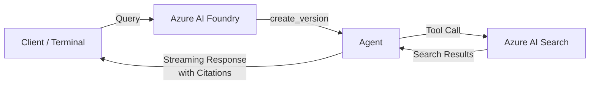
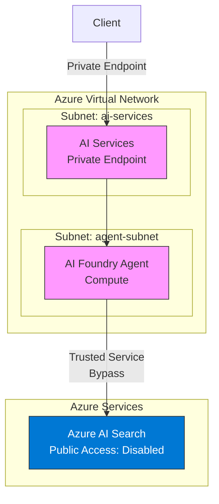
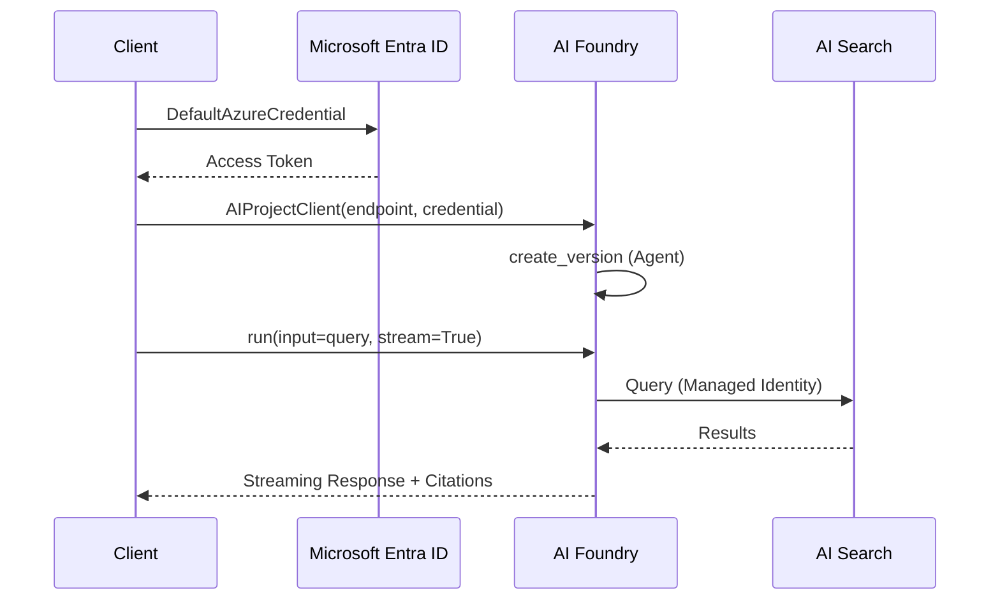

# Azure AI Foundry Agent with Azure AI Search

A working sample that creates an Azure AI Foundry agent powered by Azure AI Search using the **Responses API** (`azure-ai-projects` v2.0.0b3+). The agent queries your search index and returns grounded answers with URL citations.

## Architecture



## Network Topology (Private Setup)



## Authentication Flow



## Prerequisites

- Python 3.9+
- An Azure subscription with:
  - Azure AI Services / AI Foundry project
  - Azure AI Search service with a populated index
  - AI Search registered as a connected resource in the Foundry project
- Azure CLI installed and authenticated (`az login`)

### Required RBAC Role Assignments

Assign these roles to the identity running the agent (your user account for local dev, or managed identity for production):

| Role | Scope | Purpose |
|------|-------|---------|
| **Azure AI Developer** | AI Foundry Project | Create and manage agents |
| **Cognitive Services User** | AI Services resource | Call model deployments |
| **Search Index Data Reader** | AI Search service | Read search index data |
| **Search Service Contributor** | AI Search service | Access search service metadata |

> **Note**: Both `Search Index Data Reader` *and* `Search Service Contributor` are required. The former grants data-plane access to read index contents; the latter grants control-plane access needed by the agent to interact with the search service.

## Setup

### 1. Install Dependencies

```bash
pip install --pre -r requirements.txt
```

> **Important**: The `--pre` flag (or the `>=2.0.0b3` specifier in `requirements.txt`) is required to install the pre-release version of `azure-ai-projects` that includes the Responses API. Without it, pip installs v1.0.0 (stable), which uses the older Assistants API and does not contain the classes used in this sample.

### 2. Configure Environment

```bash
cp .env.example .env
# Edit .env with your values
```

### Environment Variables

| Variable | Description | Where to Find |
|----------|-------------|---------------|
| `FOUNDRY_PROJECT_ENDPOINT` | AI Foundry project endpoint | AI Foundry portal > Project > Overview |
| `FOUNDRY_MODEL_DEPLOYMENT_NAME` | Model deployment name (default: `gpt-4o`) | AI Foundry portal > Project > Deployments |
| `AZURE_AI_SEARCH_CONNECTION_NAME` | AI Search connection name | AI Foundry portal > Project > Settings > Connected resources |
| `AI_SEARCH_INDEX_NAME` | Search index to query | Azure portal > AI Search > Indexes |

### 3. Validate Environment

```bash
python validate_environment.py
```

This checks your environment variables, DNS resolution, network connectivity, authentication, and project connections. Fix any reported issues before proceeding.

### 4. Run the Agent

```bash
python main.py
```

The agent will:
1. Verify your AI Search connection exists
2. Create an agent with the AI Search tool
3. Prompt you to enter questions interactively
4. Stream responses with URL citations from your search index
5. Clean up the agent when you exit

## SDK Versions: Responses API vs. Assistants API

Azure AI Foundry has two SDK generations. This sample uses the **Responses API** (v2):

| Aspect | v1.x (Stable / Assistants API) | v2.0.0b3+ (Pre-release / Responses API) |
|--------|-------------------------------|----------------------------------------|
| Install | `pip install azure-ai-projects` | `pip install --pre azure-ai-projects` |
| Package version | 1.0.0 | 2.0.0b3+ |
| Additional packages | `azure-ai-agents` | None (all-in-one) |
| Search tool class | `AzureAISearchTool` | `AzureAISearchAgentTool` |
| Agent creation | `create_agent()` | `create_version()` |
| Execution model | Threads + Runs | Streaming responses |
| Agent definition | Inline | `PromptAgentDefinition` |

If you see an `ImportError` for `AzureAISearchAgentTool`, you likely have v1.x installed. Upgrade with:

```bash
pip install --pre azure-ai-projects
```

## Troubleshooting

### ImportError: cannot import 'AzureAISearchAgentTool'

**Cause**: The stable release (`pip install azure-ai-projects` = v1.0.0) does not include Responses API classes. These only exist in v2.0.0b3+.

**Fix**:
```bash
pip install --pre azure-ai-projects
# Verify:
python -c "from azure.ai.projects.models import AzureAISearchAgentTool; print('OK')"
```

### Authentication Errors

**Cause**: `DefaultAzureCredential` could not acquire a token.

**Fix**:
```bash
# Login with Azure CLI
az login

# Set the correct subscription
az account set --subscription <your-subscription-id>

# Verify
az account show
```

Ensure the required RBAC roles (see table above) are assigned to your identity.

### Connection Not Found

**Cause**: The `AZURE_AI_SEARCH_CONNECTION_NAME` does not match any registered connection in the Foundry project.

**Fix**:
1. Go to Azure AI Foundry portal > your project > Settings > Connected resources
2. Find the AI Search connection name (not the AI Search service name)
3. Update `AZURE_AI_SEARCH_CONNECTION_NAME` in your `.env` file

Run `python validate_environment.py` to list all available connections.

### DNS Resolution Failures

**Cause**: The AI Services endpoint cannot be resolved. Common with private endpoint configurations.

**Fix**:
- Ensure you are connected to the VNet (via VPN or from a VM within the network)
- Verify Private DNS Zones are configured for `*.services.ai.azure.com`
- Check conditional DNS forwarders if using custom DNS servers

### Network Timeout / Connection Refused

**Cause**: Firewall or NSG rules are blocking connectivity.

**Fix**:
- Verify NSG rules allow outbound HTTPS (port 443) to Azure services
- If using private endpoints, ensure you are routing through the VNet
- Check Azure Firewall or third-party firewall rules

### 403 Forbidden on Search Queries

**Cause**: Missing RBAC roles on the AI Search service.

**Fix**: Assign both of these roles on the AI Search service:
- `Search Index Data Reader` (or `Contributor` for write access)
- `Search Service Contributor`

## Private Networking

### Basic vs. Standard Agent Setup

Azure AI Foundry offers two agent setup modes:

- **Basic Agent Setup**: Fully managed compute, no VNet integration. Azure AI Search **does not support private access** in this mode (per [Microsoft docs](https://learn.microsoft.com/en-us/azure/ai-foundry/agents/how-to/tools/ai-search?view=foundry): "Azure AI Search doesn't support vNET configurations with agents" in Basic setup).

- **Standard Agent Setup**: Bring-your-own VNet with subnet delegation. This mode supports private AI Search through the **Trusted Services bypass**.

### How Private AI Search Works with Standard Setup

1. **Subnet delegation**: A subnet is delegated to `Microsoft.App/environments` for agent compute
2. **Private endpoints**: AI Services gets a private endpoint in the VNet
3. **Trusted Services bypass**: AI Search is configured to allow access from trusted Azure services, which includes AI Services managed identity
4. **No public access needed**: AI Search can have public network access fully disabled

### Foundry Playground with Private Endpoints

When public access is disabled on AI Services, the AI Foundry Playground (web UI) requires network-level access to the private endpoint. This means:
- You need VPN or a browser running inside the VNet to use the Playground
- The SDK/CLI works from any location that can reach the private endpoint
- Consider Azure Bastion for secure browser access to the Playground

## References

- [Azure AI Projects on PyPI](https://pypi.org/project/azure-ai-projects/)
- [AI Search Tool for Foundry Agents](https://learn.microsoft.com/en-us/azure/ai-foundry/agents/how-to/tools/ai-search?view=foundry)
- [Private Network Standard Agent Setup](https://github.com/microsoft-foundry/foundry-samples/blob/main/infrastructure/infrastructure-setup-bicep/15-private-network-standard-agent-setup/README.md)
